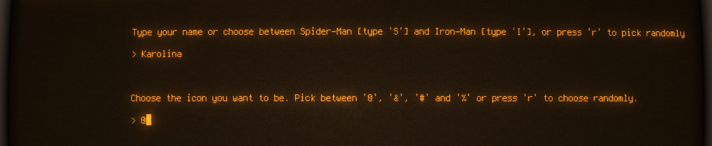
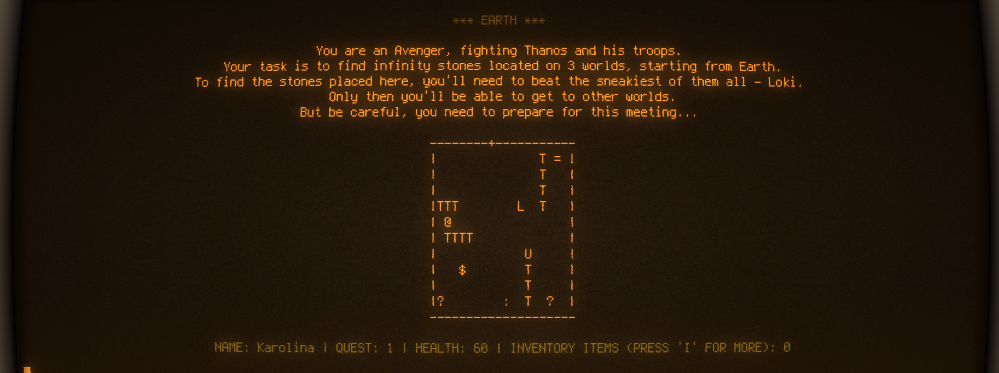
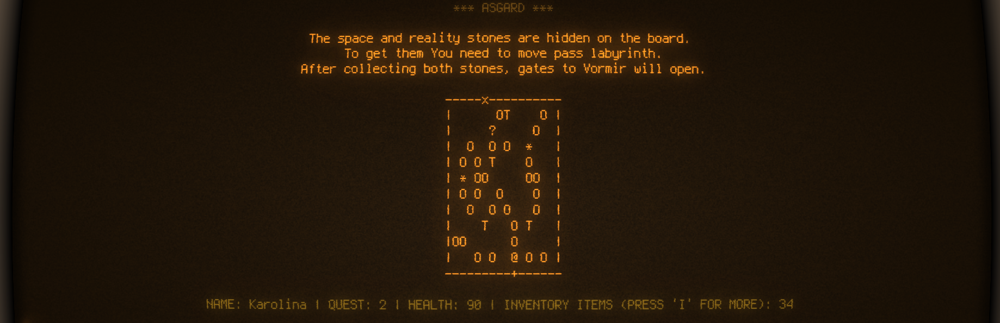
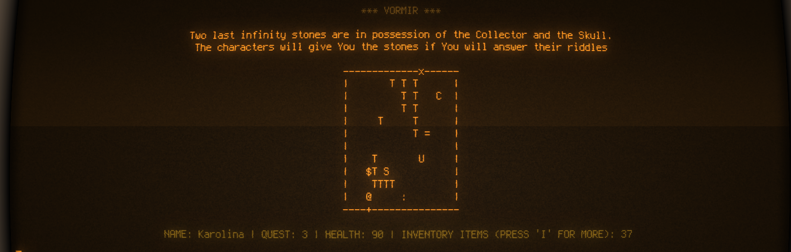
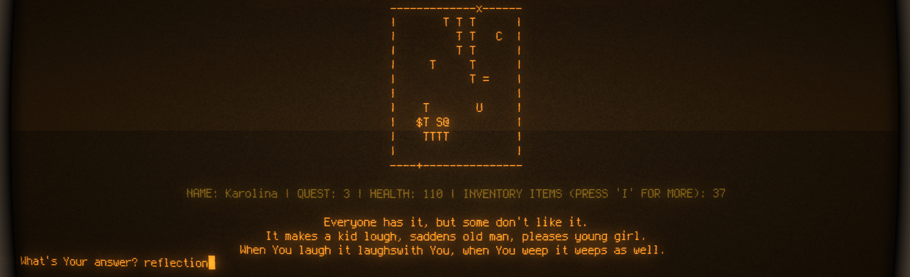
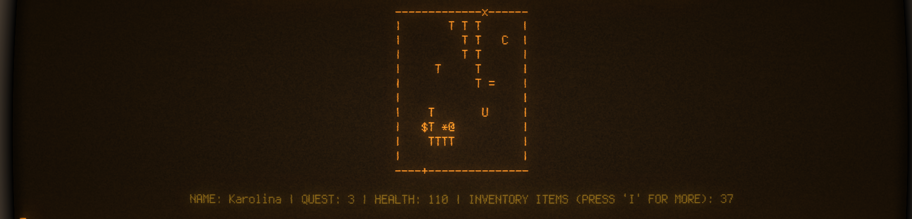
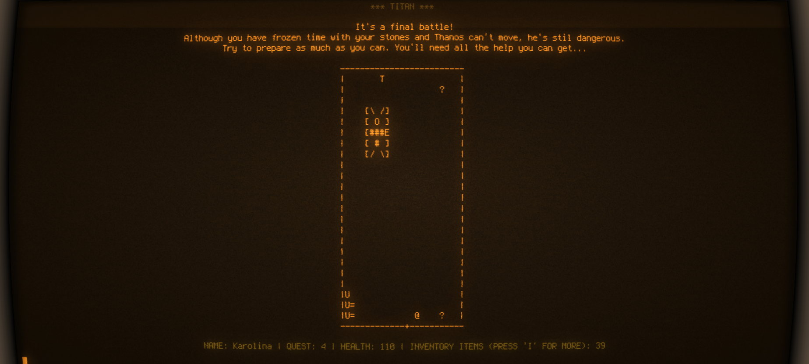
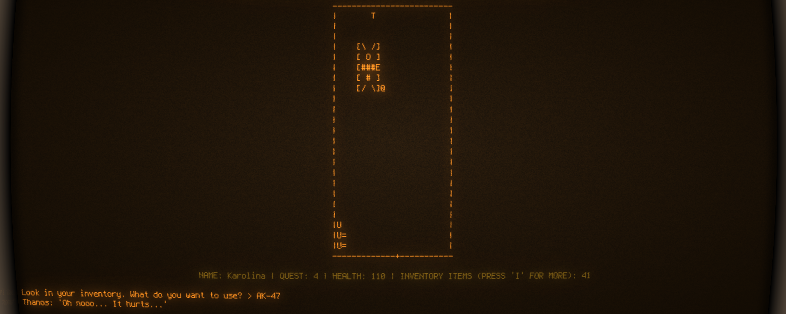

# Python exercise 5 - Roguelike game (Avengers-themed)
Project done in 4-people groups, during 2 weeks of distance cooperation and 2 days of workshops.
The aim of the project was to create a game resembling the 80' unix game - Rogue. We've chosen the Avengers movies to be an inspiration for game's plot.
Another aspect important for the execution was the fact, that the project had to be based on the dictionaries, as a part of introduction to OOP.

## General info
The main game features that we managed to deliver were:
* creating basic board generator function, returning list of lists of given sizes, with walls around it
* displaying board, together with other elements present on it (exits, items, characters, player)
* implementing user's movement on the board via pressing the WASD keys. Player cannot walk through walls, but going through gates loads another board.
* implementing items that can be added to player's inventory and can be used in later game. Some items are food that increas player's health.
* adding attributes to player and presenting their statistics under the board.
* adding other characters and interactions between them and player (movement, fight, riddles)
* adding large boss at the end of the game and fight with it (there is a secret code that makes to finish the game more easily).
* the player can win the game by collecting needed items and beating the boss, or can loose the game when their health drops to 0.
* adding visual improvements to the project (centering the board, adding colors, effects)
* player can display legend and details of their inventory.

## Plot of the game
Player starts with choosing or randomly selecting their name and icon:

At any point of the game player can display legend to make sure which symbol means what:

Quest 1 - EARTH:
The adventure starts on Earth, where player needs to find 2 infinity stones. To do so, he needs to beat Loki. Loki moves independently on the board and can kill us when we don't find proper armor.

After killing Loki, two infinity stones reveal themselves. Only if we collect them, the gates to the next world will open.

Quest 2 - ASGARD:
On this planet player needs to find and collect two infinity stones in the labirynth. That will open another gates.

Quest 3 - VORMIR:
In this quest player needs to find two characters: Skull and Collector, and resolve their riddles. If they fail - they die after 3rd attempt. If they succeed - characters change into another infinity stones.

Quest 4 - TITAN:
On the last board player needs to face Thanos. To do so, he needs to collect the armor from the board and use it properly in the fight.

At any moment player can display or hide the table with the inventory:

Also, it is possible to win the battle using secret cheat code:

But to do it properly, player must approach Thanos and use the recently found weapons against him:

## Technologies
* Python 3.6

## Lessons learned from the assignment
* Working with multi-leveled dictionaries as an introduction to objective programming in the future
* Working in bigger groups and coordinating project by students
* Clean code issues and proper code documentation

## Status
Project is finished.

## Credits
Project assigned and supervised by Codecool mentors.