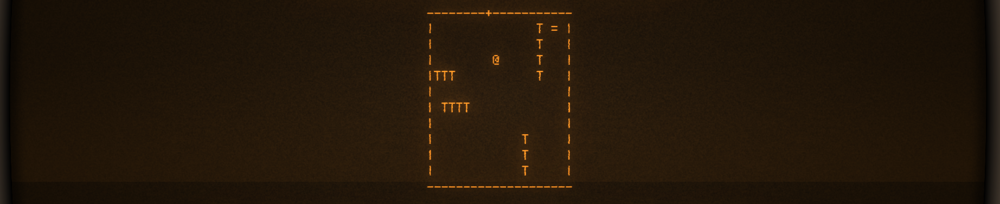
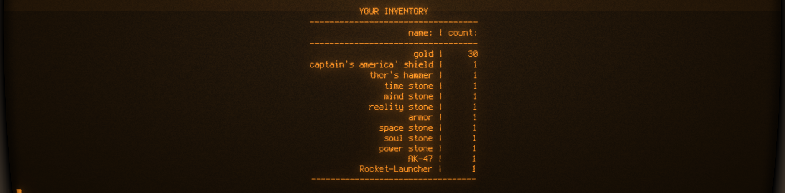
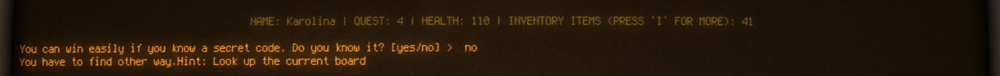

# Python exercise 5 - Roguelike game (Avengers-themed)
Project done in 4-people groups, during 2 weeks of distance cooperation and 2 days of workshops.
The aim of the project was to create a game resembling the 80' unix game - Rogue. We've chosen the Avengers movies to be an inspiration for game's plot.
Another aspect important for the execution was the fact, that the project had to be based on the dictionaries, as a part of introduction to OOP.

## General info
The main game features that we managed to deliver were:
* creating basic board generator function, returning list of lists of given sizes, with walls around it
* displaying board, together with other elements present on it (exits, items, characters, player)
* implementing user's movement on the board via pressing the WASD keys. Player cannot walk through walls, but going through gates loads another board.
* implementing items that can be added to player's inventory and can be used in later game. Some items are food that increas player's health.
* adding attributes to player and presenting their statistics under the board.
* adding other characters and interactions between them and player (movement, fight, riddles)
* adding large boss at the end of the game and fight with it (there is a secret code that makes to finish the game more easily).
* the player can win the game by collecting needed items and beating the boss, or can loose the game when their health drops to 0.
* adding visual improvements to the project (centering the board, adding colors, effects)
* player can display legend and details of their inventory.

## Plot of the game
1:

2:

3:

1:

2:

3:

1:

2:

3:

1:

2:

3:

1:

2:

3:

## Technologies
* Python 3.6

## Lessons learned from the assignment
* Working with dictionaries as an introduction to objective programming in the future
* Working with main() function as a game's engine
* Planning game's logic to be as effective as possible

## Status
Project is finished.

## Credits
Project assigned and supervised by Codecool mentors.

## Story

"

## Features

1. Implement0 a basic board generator function to return a rectangular board of the given size.

    - The `engine.create_board` function returns an empty, rectangular board as a list of lists of the given size, containing characters according to the field type (e.g. spaces all around and wall icons on its edges).
    - The game has at least 3 boards/levels with different inhabitants.
    - Gates are added on the edges (one gate character instead of one piece of wall).

2. Implement board and player display. The player always sees the actual board only.

    - The function `ui.display_board` displays a board (passed as an argument).
    - The function `engine.put_player_on_board` places the player icon on the board.

3. Implement the player's movement on the board via pressing the WASD keys.

    - The WASD keys move the player up, left, down, and right on the screen, respectively.
    - The player cannot move through walls.
    - Going through a gate loads another board (the same door always leads to the same place).

4. Implement items that can be added to the player's inventory by moving upon them.

    - The items have at least two attributes, name and type. You can add others as well.
    - The items are displayed on the board.
    - The items disappear from the board when the player moves upon them. They shouldn't appear again when the player reenters the board.
    - One type of items is food - these update the player's state and disappear.
    - Other types of items are added to the player's inventory when taken up.
    - Implement at least two features connecting to items (like keys for opening gates, weapons, armors, etc.)
    - The inventory is displayed upon pressing the `I` key.

5. The player has various (constant and variable) attributes.

    - The player's character has a name, a race (e.g. elf, dwarf), and health. You can add others as well.
    - The player can choose or configure their character before starting the game.
    - The player's character may die if its vital attributes become too low.
    - The character's main attributes are displayed on the screen all the time.

6. Implement other inhabitants around the player's character.

    - These characters have three mandatory attributes, name, type, and health.
    - Create at least three different types (except for the player and the boss).
    - There are autonomously moving characters, also respecting the walls. They move only when the player moves.
    - Implement a creature who says something upon meeting the player.
    - Fight is implemented against enemies. A fight consist of rounds (hits), and a hit happens when the player tries to move "upon" the enemy. The hit on the player's and the creature's health is calculated based on their attributes, the inventory, and randomness.

7. A roguelike game needs a boss fight at the very end!

    - The boss is a larger (at least 5-by-5), autonomously moving character.
    - An extremely hard boss fight is implemented (e.g. special weapons are needed, the hit chance is low).
    - There is a secret code that makes to finish the game more easily.

8. [OPTIONAL] Create a Hall of Fame with the highest scores.

    - The top 5 achievements are displayed.
    - The top achievements are saved into and loaded from file.
    - Cheat mode wins are excluded from the Hall of Fame.

9. [OPTIONAL] Save relevant data and show statistics to the player about the actual game.

    - Collect statistics about important game events (e.g. fights, discovered boards, items).
    - The player's statistics are displayed upon pressing `P`.

10. [OPTIONAL] Create a story that grabs attention.

    - There is an intro screen before the game about its world.
    - There is a final screen after winning or losing the game.
    - There is an information screen on the authors.
    - There is an information screen on how to play the game.

11. [OPTIONAL] Implement further board generating algorithms.

    - The `engine.create_board` function has other optional parameters that modify its base behavior to add extra inner walls.
    - The `engine.create_board` function has other optional parameters that modify its base behavior to diverge from the rectangular shape.

## What are you going to learn?

You will learn and practice how to do the following things in Python:
 - variables, functions, loops and conditionals,
 - nested lists,
 - dictionaries,
 - print formatting,
 - handling user input,
 - error handling,
 - clean code.

## General requirements

 - Always use predefined constants for icons in your code. You can modify them, though.

## Hints

- It is time to start thinking in "objects"! Objects are bundles of
  attributes and behavior: players have names, coordinates, inventories,
  things may have a type, a weight, a price, etc., and also there are
  functions that deal with players or things. We do not necessarily need
  proper object-oriented programming for this, plain dictionaries also
  can do the job. For example, the dictionary `item = {'name': 'Needle',
  'type': 'sword', 'weight': 42}` holds together three attributes in one
  variable which can be passed between functions that _expect_ these
  attributes (e.g. the `'name'` attribute to print it).
- Objects usually have _states_ that may or may not change during its
  interactions. For example, `"strength"` is a player attribute that can
  change during a combat or after a meal. Also it can trigger other
  state changes like character upgrade or death.
- Try to abstract away the differences and create as general categories
  as possible! The differences should live in the data attributes
  assigned to general things. And not just "things", you also can
  distill abstract interactions like "fights" or "conversations". With
  this you'll get a flexible and extendable game.
- Try to generate data! . You also can try creating playable boards.
- The `util` module contains two basic OS-dependent functions, one
  for clearing the screen and one for getting user keystrokes. You
  shouldn't bother too much with terminal emulation.

## Starting repository

Click here to clone your own Git repository:
https://classroom.github.com/g/98QVWNNf

## Background materials

- [Dictionaries](https://learn.code.cool/codecool-graph/#/../pages/python/dictionaries)
- [Modifying objects](https://learn.code.cool/codecoo.l-graph/#/../pages/python/modifying-objects)
- [User input](https://learn.code.cool/codecool-graph/#/../pages/python/user-input)
- [Clean code](https://learn.code.cool/codecool-graph/#/../pages/general/clean-code)
- [About Python modules](https://realpython.com/python-modules-packages/)
  (until the section "Python Packages")

## Acceptance review

You will need this only at review time, **after** completing the
project. [Use this form](https://forms.gle/zrSatwSjWyLgWJLT8) to record
the review you provide for your peer.